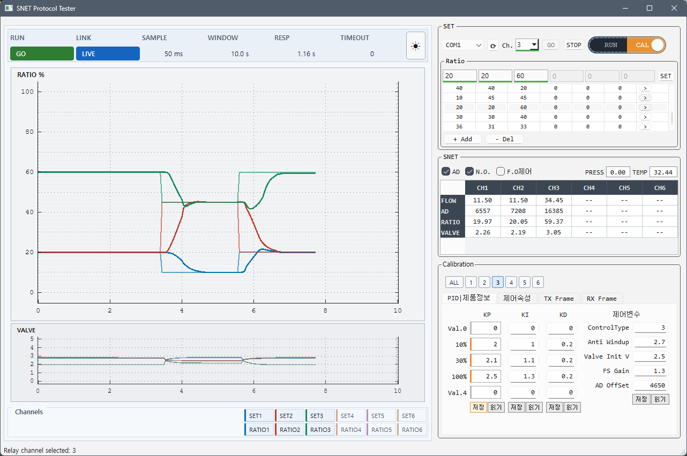

# SNET Protocol Tester

A desktop GUI tool for testing SNET serial protocol communication with multi-channel flow controllers. Built with PySide6 (Qt6).

Works without hardware — just run with `--mock`.

## Screenshots

| Real-time graph | TX/RX Frame |
|---|---|
|  |  |

## Features

- Control 6 channels with real-time ratio setpoints
- Live graphs for ratio (%) and valve (V) with 10-second rolling window
- Save and load channel presets
- Read/write Brooks KP calibration coefficients
- PID tuning (KP/KI/KD)
- Read/write device variables, full-open control, RUN/CAL mode switch
- Mock mode for testing without hardware
- Fault injection (timeout, corrupt data, disconnect, etc.)

## Getting Started

**Requirements:** Python 3.13+, [uv](https://docs.astral.sh/uv/)

```bash
# Install
uv sync

# Run (mock mode — no hardware needed)
uv run python -m snet_tester2 --mock

# Run (real hardware)
uv run python -m snet_tester2 --port COM6 --baud 115200
```

## Project Structure

```
snet_tester2/
├── protocol/     Frame codec, parser, types, enums (no Qt dependency)
├── transport/    SerialTransport & MockTransport
├── comm/         Worker thread with typed events/commands
├── state/        Statistics (Welford online mean/variance)
├── views/        UI — MainWindow, TxPanel, RxPanel, PlotView
└── resources/    Qt Designer .ui file, presets.json

snet_tester/      v1 legacy (PyQt5), shares v2 core
tests/            177 tests
tools/            UI consistency checker
```

## SNET Frame Format

```
[STX 0xA5 0x5A] [SEQ] [ID] [CH] [CMD 2B] [LEN] [PAYLOAD...]
```

| Command | Code | Description |
|---------|------|-------------|
| IO_REQUEST | `0x8000` | Send channel ratios, receive monitor data |
| IO_RESPONSE | `0x8100` | Monitor response (AD, flow, ratio, valve) |
| READ_VAR | `0x0001` | Read device variable |
| WRITE_VAR | `0x0002` | Write device variable |
| BROOKS_GET_KP | `0x104C` | Read KP calibration coefficients |

## Testing

```bash
# Run all tests
uv run pytest -v

# By layer
uv run pytest tests/test_v2_codec.py tests/test_v2_parser.py   # protocol
uv run pytest tests/test_v2_transport_mock.py                   # fault injection
uv run pytest tests/test_v2_worker.py                           # worker
uv run pytest tests/test_v2_pyside6_smoke.py                    # UI smoke tests
```

## Development

```bash
# Open Qt Designer
uv run snet-designer2

# Check UI consistency
uv run python tools/check_ui_consistency.py --strict
```

## License

Proprietary
